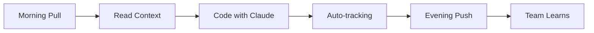

# 👥 Team Setup & Collaboration Guide

## Table of Contents
1. [Quick Start for Teams](#quick-start-for-teams)
2. [Individual Developer Setup](#individual-developer-setup)
3. [Team Lead Setup](#team-lead-setup)
4. [Collaboration Workflows](#collaboration-workflows)
5. [Knowledge Sharing Patterns](#knowledge-sharing-patterns)
6. [Conflict Resolution](#conflict-resolution)
7. [Best Practices](#best-practices)
8. [Team Scaling Guide](#team-scaling-guide)

---

## Quick Start for Teams

### 🚀 30-Second Team Setup

**Team Lead** (one time):
```bash
# 1. Initialize system
curl -O https://your-repo/lazy-genius/setup.sh
chmod +x setup.sh
./setup.sh

# 2. Commit foundation
git add .claude-team
git commit -m "Initialize Lazy Genius 2.0"
git push origin main
```

**Each Developer**:
```bash
# 1. Pull team setup
git pull origin main

# 2. Configure personal workspace
cp .claude-team/templates/hooks.json .claude/hooks.json
git config --local user.name "Your Name"

# 3. Verify setup
echo "test" > test.txt && rm test.txt
ls .claude-team/daily/  # Should see your daily log
```

**That's it!** The system is now tracking everything automatically.

---

## Individual Developer Setup

### Step 1: Prerequisites Check

```bash
# Check Git is configured
git config user.name || git config --global user.name "Your Name"
git config user.email || git config --global user.email "your.email@company.com"

# Check Claude Code is installed
claude --version || echo "Please install Claude Code"

# Optional but recommended
jq --version || echo "Install jq for better hook functionality"
```

### Step 2: Personal Workspace Setup

```bash
# Create your local workspace (not shared)
mkdir -p .claude

# Copy team hooks configuration
cp .claude-team/templates/hooks.json .claude/hooks.json

# Create personal notes file
cat > .claude/personal.md << EOF
# Personal Notes - $(git config user.name)

## My Focus Areas
- [ ] Current task
- [ ] Learning goals

## Quick References
- Team patterns: .claude-team/patterns/
- Solutions: .claude-team/SOLUTIONS.md
- Avoid: .claude-team/ANTIPATTERNS.md
EOF
```

### Step 3: First Session Test

```bash
# Start Claude Code
claude

# Make a test edit
echo "test" > test-file.txt

# Check your daily log was created
cat .claude-team/daily/$(date +%Y-%m-%d)-$(git config user.name | tr ' ' '-').md

# Clean up
rm test-file.txt
```

### Step 4: Configure Your Workflow

```bash
# Add helpful aliases to your shell profile (.bashrc/.zshrc)
cat >> ~/.bashrc << 'EOF'
# Lazy Genius aliases
alias claude-sync='.claude-team/scripts/sync.sh'
alias claude-analyze='.claude-team/scripts/analyze.sh'
alias claude-predict='.claude-team/scripts/predict.sh'
alias claude-log='cat .claude-team/daily/$(date +%Y-%m-%d)-$(git config user.name | tr " " "-").md'
EOF

source ~/.bashrc
```

---

## Team Lead Setup

### Initial System Configuration

```bash
#!/bin/bash
# team-lead-init.sh - Complete team lead setup

# 1. Set up base system
./setup.sh

# 2. Configure team-specific patterns
cat > .claude-team/patterns/team-conventions.md << EOF
# Team Conventions

## Code Style
- Use ESLint configuration in .eslintrc
- Follow naming conventions in STYLE_GUIDE.md
- PR reviews required for main branch

## Architecture Patterns
- API calls through central client
- State management via Context/Redux
- Component composition over inheritance

## Testing Requirements
- Minimum 80% coverage for new code
- Integration tests for API endpoints
- E2E tests for critical user flows
EOF

# 3. Set up team templates
cat > .claude-team/templates/pr-review.md << EOF
# PR Review Checklist

- [ ] Code follows team conventions
- [ ] Tests are included and passing
- [ ] Documentation updated
- [ ] No console.logs or debug code
- [ ] Performance impact considered
- [ ] Security implications reviewed
EOF

# 4. Initialize team session focus
cat > .claude-team/SESSION.md << EOF
# Current Sprint: Sprint $(date +%V)

## Goals
1. Primary: [Main sprint goal]
2. Secondary: [Secondary goals]

## Team Assignments
- Alice: Feature X
- Bob: Bug fixes
- Charlie: Testing

## Blocked Items
- None currently

## Important Dates
- Sprint Review: [Date]
- Deployment: [Date]
EOF

# 5. Create onboarding readme
cat > .claude-team/ONBOARDING.md << EOF
# Team Onboarding

Welcome to the team! Follow these steps:

1. Run: git pull origin main
2. Run: .claude-team/scripts/onboard.sh
3. Read: .claude-team/patterns/team-conventions.md
4. Review: .claude-team/ANTIPATTERNS.md
5. Start coding with Claude!

## Resources
- Team Slack: #dev-team
- Documentation: /docs
- CI/CD: Jenkins/GitHub Actions
EOF

# 6. Commit everything
git add .claude-team
git commit -m "Team lead initialization complete"
git push origin main

echo "✅ Team lead setup complete!"
```

### Weekly Maintenance Tasks

```bash
# Monday Morning Routine
./claude-team/scripts/analyze.sh          # Review last week
./claude-team/scripts/cleanup.sh          # Archive old logs
./claude-team/scripts/report.sh > weekly-report.md

# Update team focus
vi .claude-team/SESSION.md                # Update sprint goals

# Share insights
vi .claude-team/ANTIPATTERNS.md          # Add discovered issues
vi .claude-team/SOLUTIONS.md              # Document what worked

# Sync with team
git add .claude-team
git commit -m "Weekly update: $(date +%Y-W%V)"
git push origin main
```

---

## Collaboration Workflows

### Daily Developer Workflow



```bash
# Morning Routine (30 seconds)
git pull origin main                      # Get team's overnight work
cat .claude-team/SESSION.md              # See today's focus
./claude-team/scripts/predict.sh         # See predicted work
claude                                    # Start working

# During Day (automatic)
# Hooks track everything - no manual action needed

# Evening Routine (30 seconds)
./claude-team/scripts/sync.sh            # Push your knowledge
```

### Feature Development Workflow

```bash
# Developer A starts a feature
git checkout -b feature/user-auth
cp .claude-team/templates/feature.md .claude-team/features/user-auth.md
vi .claude-team/features/user-auth.md    # Plan the feature

# Work with Claude
claude "Implement user authentication"
# ... Claude reads team patterns and avoids antipatterns ...

# Share progress
git add .
git commit -m "feat: user auth progress"
git push origin feature/user-auth

# Developer B continues the feature
git checkout feature/user-auth
git pull origin feature/user-auth
claude "Continue user auth implementation"
# Claude sees Developer A's work and patterns!
```

### Code Review Workflow

```bash
# Before review
./claude-team/scripts/analyze.sh | grep "$(git branch --show-current)"

# Create PR with context
cat > pr-description.md << EOF
## Changes
$(grep "Edit:" .claude-team/daily/$(date +%Y-%m-%d)*.md | tail -10)

## Patterns Used
- Referenced: .claude-team/patterns/auth.md
- Avoided: Issue #23 from ANTIPATTERNS.md

## Testing
- Unit tests: ✅
- Integration tests: ✅
EOF

# After merge
echo "## Solution: User Auth Implementation" >> .claude-team/SOLUTIONS.md
echo "- Pattern: JWT with refresh tokens" >> .claude-team/SOLUTIONS.md
echo "- Files: auth/, tests/auth/" >> .claude-team/SOLUTIONS.md
```

---

## Knowledge Sharing Patterns

### Pattern 1: Morning Standup Enhancement

```bash
# Generate standup notes automatically
#!/bin/bash
# standup.sh - Generate standup notes

YESTERDAY=$(date -d "yesterday" +%Y-%m-%d || date -v-1d +%Y-%m-%d)
TODAY=$(date +%Y-%m-%d)
DEV=$(git config user.name | tr ' ' '-')

echo "## Standup - $(git config user.name)"
echo ""
echo "### Yesterday:"
if [ -f ".claude-team/daily/$YESTERDAY-$DEV.md" ]; then
  grep "Edit:\|Write:" ".claude-team/daily/$YESTERDAY-$DEV.md" | \
    sed 's/.*\(Edit\|Write\): /- /' | sort -u | head -5
else
  echo "- No tracked activity"
fi

echo ""
echo "### Today:"
if [ -f ".claude-team/memory/context/current.md" ]; then
  grep "^-" ".claude-team/memory/context/current.md" | head -3
fi

echo ""
echo "### Blockers:"
grep -i "error\|failed\|blocked" ".claude-team/daily/$TODAY-$DEV.md" 2>/dev/null | head -3 || echo "- None"
```

### Pattern 2: Knowledge Broadcast

```bash
# When discovering something important
echo "## Important Discovery: $(date)" >> .claude-team/SOLUTIONS.md
echo "- Problem: API rate limiting" >> .claude-team/SOLUTIONS.md
echo "- Solution: Implement exponential backoff" >> .claude-team/SOLUTIONS.md
echo "- Code: utils/api-retry.js" >> .claude-team/SOLUTIONS.md

# Immediately share
git add .claude-team/SOLUTIONS.md
git commit -m "Solution: API rate limit handling"
git push origin main

# Team gets notification (optional webhook)
curl -X POST $SLACK_WEBHOOK -d \
  '{"text":"New solution documented: API rate limit handling"}'
```

### Pattern 3: Cross-Team Learning

```bash
# Export knowledge for other teams
tar czf team-knowledge-export-$(date +%Y%m%d).tar.gz \
  .claude-team/patterns/ \
  .claude-team/SOLUTIONS.md \
  .claude-team/ANTIPATTERNS.md

# Import knowledge from another team
tar xzf other-team-knowledge.tar.gz
mv other-team/patterns/* .claude-team/patterns/external/
cat other-team/SOLUTIONS.md >> .claude-team/external-solutions.md
```

---

## Conflict Resolution

### Automatic Conflict Resolution

The system handles most conflicts automatically:

```bash
# In .gitattributes
.claude-team/daily/*.md merge=union     # Combines both versions
.claude-team/ANTIPATTERNS.md merge=union # Keeps all antipatterns
.claude-team/SESSION.md merge=ours       # Latest version wins
```

### Manual Conflict Resolution

When conflicts occur:

```bash
# 1. Run the conflict resolver
./claude-team/scripts/sync.sh resolve

# 2. For remaining conflicts
git status --short | grep "^UU"

# 3. For knowledge files, usually keep both
cat conflicted-file.md | sed '/<<<<<<</,/>>>>>>>/d' > temp.md
mv temp.md conflicted-file.md
git add conflicted-file.md

# 4. Complete the merge
git commit -m "Resolved knowledge conflicts"
git push origin main
```

### Preventing Conflicts

```bash
# Best practices to avoid conflicts

# 1. Pull before starting work
git pull --rebase origin main

# 2. Push frequently (at least daily)
./claude-team/scripts/sync.sh

# 3. Use developer-specific daily files
# These rarely conflict: 2024-01-15-alice.md, 2024-01-15-bob.md

# 4. Coordinate through SESSION.md
vi .claude-team/SESSION.md  # Update your focus area
```

---

## Best Practices

### 1. Daily Habits

```markdown
## Developer Daily Checklist

### Morning (2 minutes)
- [ ] Pull latest: `git pull origin main`
- [ ] Read focus: `cat .claude-team/SESSION.md`
- [ ] Check predictions: `./claude-team/scripts/predict.sh`
- [ ] Start Claude with context

### During Work (automatic)
- Hooks track everything
- Claude reads team patterns
- Knowledge accumulates

### Evening (1 minute)
- [ ] Sync knowledge: `./claude-team/scripts/sync.sh`
- [ ] Review your day: `claude-log`
```

### 2. Weekly Team Rituals

```markdown
## Team Weekly Checklist

### Monday - Planning
- [ ] Update SESSION.md with sprint goals
- [ ] Review last week's patterns
- [ ] Clean up old logs

### Wednesday - Mid-Sprint Check
- [ ] Run analysis: `./claude-team/scripts/analyze.sh`
- [ ] Update ANTIPATTERNS.md
- [ ] Share discoveries in standup

### Friday - Knowledge Share
- [ ] Document solutions found this week
- [ ] Archive completed feature docs
- [ ] Generate weekly report
```

### 3. Documentation Discipline

```bash
# When you discover a pattern
echo "- $(date): Pattern discovered" >> .claude-team/memory/patterns.md

# When something fails
echo "- Don't: [what failed] ($(date))" >> .claude-team/ANTIPATTERNS.md

# When something succeeds
echo "- Do: [what worked] ($(date))" >> .claude-team/SOLUTIONS.md

# Always commit knowledge
git add .claude-team && git commit -m "Knowledge: [brief description]"
```

---

## Team Scaling Guide

### 2-5 Developers (Startup)

```bash
# Simple setup
- One shared .claude-team/ directory
- Daily sync via git push/pull
- Weekly analyze.sh runs
- Informal knowledge sharing
```

### 5-20 Developers (Growth)

```bash
# Add structure
.claude-team/
├── patterns/
│   ├── frontend/        # Frontend team patterns
│   ├── backend/         # Backend team patterns
│   └── devops/          # DevOps patterns
├── daily/
│   └── [date]-[developer].md  # Individual tracking
└── teams/
    ├── frontend-SESSION.md
    ├── backend-SESSION.md
    └── devops-SESSION.md

# Add team-specific aliases
alias claude-frontend='cat .claude-team/teams/frontend-SESSION.md'
alias claude-backend='cat .claude-team/teams/backend-SESSION.md'
```

### 20+ Developers (Scale)

```bash
# Implement sub-teams
team-frontend/
├── .claude-team/     # Frontend team knowledge
└── sync-to-main.sh   # Sync important patterns upstream

team-backend/
├── .claude-team/     # Backend team knowledge
└── sync-to-main.sh   # Sync important patterns upstream

main/
├── .claude-team/     # Shared organizational knowledge
├── patterns/         # Company-wide patterns
└── import-team.sh    # Import from sub-teams

# Automated rollup
0 9 * * 1 /path/to/weekly-rollup.sh  # Monday morning aggregation
```

### Enterprise (100+)

```bash
# Hierarchical knowledge structure
org/
├── .claude-central/          # Organization-wide
│   ├── patterns/
│   ├── standards/
│   └── compliance/
├── division-engineering/     # Division level
│   └── .claude-team/
├── team-payment-frontend/   # Team level
│   └── .claude-team/
└── sync-hierarchy.sh        # Multi-level sync

# Add governance
.claude-team/
├── approved-patterns/       # Reviewed and approved
├── experimental-patterns/   # Under evaluation
└── deprecated-patterns/     # No longer recommended

# Metrics dashboard
./generate-metrics.sh > /var/www/dashboard/metrics.json
```

---

## Team Success Metrics

Track these to ensure the system is working:

### Adoption Metrics
```bash
# How many developers are using it?
ls .claude-team/daily/*.md | cut -d'-' -f4- | cut -d'.' -f1 | sort -u | wc -l

# How active is knowledge sharing?
git log --oneline --since="1 week ago" .claude-team | wc -l

# Are patterns being discovered?
wc -l .claude-team/memory/patterns.md
```

### Quality Metrics
```bash
# Reduction in repeated mistakes
grep -c "rabbit hole\|repeated\|again" .claude-team/ANTIPATTERNS.md

# Knowledge reuse
grep -c "used pattern from\|referenced" .claude-team/daily/*.md

# Problem resolution speed
# Compare time between problem first mentioned and solution documented
```

### Health Checks
```bash
#!/bin/bash
# team-health.sh - Check system health

echo "🏥 Team Knowledge System Health Check"
echo "====================================="

# Check participation
ACTIVE=$(ls .claude-team/daily/$(date +%Y-%m-%d)*.md 2>/dev/null | wc -l)
TOTAL=$(git log --format="%an" | sort -u | wc -l)
echo "✅ Participation: $ACTIVE/$TOTAL developers active today"

# Check knowledge growth
SIZE=$(du -sh .claude-team | cut -f1)
PATTERNS=$(grep -c "^-" .claude-team/memory/patterns.md 2>/dev/null || echo 0)
echo "✅ Knowledge: $SIZE total, $PATTERNS patterns documented"

# Check sync status
BEHIND=$(git rev-list --count HEAD..origin/main 2>/dev/null || echo 0)
if [ "$BEHIND" -gt 0 ]; then
  echo "⚠️ Sync: $BEHIND commits behind origin"
else
  echo "✅ Sync: Up to date with team"
fi

# Check for issues
ERRORS=$(grep -c "error\|failed" .claude-team/daily/$(date +%Y-%m-%d)*.md 2>/dev/null || echo 0)
if [ "$ERRORS" -gt 5 ]; then
  echo "⚠️ Issues: $ERRORS errors detected today"
else
  echo "✅ Issues: $ERRORS errors (normal)"
fi
```

---

## Quick Reference Card

```markdown
# 🎯 Lazy Genius 2.0 - Quick Reference

## Essential Commands
git pull                          # Start your day
./claude-team/scripts/sync.sh     # End your day
./claude-team/scripts/analyze.sh  # See patterns
claude-log                        # View your activity

## Key Files
.claude-team/SESSION.md           # Current focus
.claude-team/ANTIPATTERNS.md      # What to avoid
.claude-team/SOLUTIONS.md         # What works
.claude-team/patterns/            # Domain patterns

## Troubleshooting
No logs? → Check git config user.name
Conflicts? → Run sync.sh resolve
Not syncing? → Check git remote
Hooks not working? → Verify .claude/hooks.json

## Team Contacts
Lead: [Name] (slack: @lead)
Help: #lazy-genius-help
Docs: .claude-team/ONBOARDING.md
```

Print this and keep it handy!